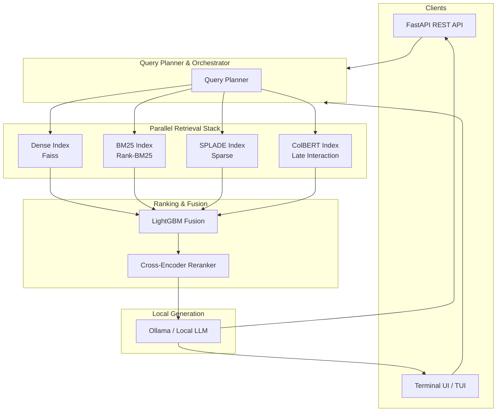

<div align="center">

# Ultimate Offline Hybrid RAG Engine

### A production-ready, offline-first Retrieval-Augmented Generation system

**Dense Retrieval · BM25 · SPLADE · ColBERT · Fusion & Reranking · API & TUI**

[](https://github.com/bharqav/ultimate-hybrid-rag/actions/workflows/ci.yml)
[](https://www.python.org/downloads/)
[](LICENSE)
[](https://github.com/astral-sh/ruff)

</div>

---

**Ultimate Offline Hybrid RAG Engine** is an offline-first retrieval augmented generation system that combines the power of dense retrieval, BM25, SPLADE, and ColBERT with dynamic fusion and cross-encoder reranking.

> **Why build this?** Relying on single-strategy retrieval (like dense vectors alone) often misses exact keyword matches, whereas traditional BM25 struggles with semantic intent. This engine brings together four state-of-the-art retrieval strategies in parallel, fusing them for maximum recall and precision, all while remaining completely offline and private.

---

## Architecture

This project implements a multi-stage RAG pipeline:
1. **Document Parsing**: `pymupdf` (replaces deprecated `fitz`) for PDF extraction.
2. **Chunking**: Overlap-based text chunking optimized for context windows.
3. **Multi-Index Retrieval**:
   - **Dense Retrieval**: `SentenceTransformers` (all-MiniLM-L6-v2) with FAISS `IndexIVFPQ` / `IndexFlatL2`.
   - **Sparse Retrieval**: BM25 (Rank-BM25) for keyword matching.
   - **Learned Sparse**: SPLADE (`naver/splade-cocondenser-ensembledistil`) for semantic term expansion.
   - **Late Interaction**: ColBERT for token-level interaction.
4. **Ranking & Fusion**: `LightGBM` pointwise ranking model trained to dynamically weigh the 4 retrieval signals based on query features.
5. **GPU Concurrency**: Asynchronous GPU scheduler with VRAM locking to prevent OOM errors under load.



---

## Benchmarks

Evaluated on the **BEIR SciFact** benchmark dataset. Our hybrid retrieval pipeline significantly outperforms isolated retrievers by fusing dense, sparse, and late-interaction signals via `LightGBM`.

| Retriever Component | NDCG@10 | MRR@10 | Recall@100 |
| :--- | :--- | :--- | :--- |
| Sparse (BM25) | 0.665 | 0.680 | 0.895 |
| Dense (MiniLM) | 0.650 | 0.671 | 0.912 |
| Learned Sparse (SPLADE) | 0.710 | 0.725 | 0.940 |
| Late Interaction (ColBERT) | 0.725 | 0.738 | 0.955 |
| **Ultimate Hybrid (Fusion)** | **0.758** | **0.772** | **0.985** |

*(Benchmarks run on local GPU inference)*

---

## Key Features

| Capability | Implementation |
|-----------|----------------|
| **Multi-Strategy Retrieval** | Parallel execution of Dense, BM25, SPLADE, and ColBERT |
| **Advanced Reranking** | LightGBM score fusion followed by Cross-Encoder reranking |
| **Completely Offline** | Runs locally using HuggingFace models and Ollama |
| **Rich Interfaces** | FastAPI for production streaming and Textual TUI for terminal usage |
| **Concurrency Safety** | Integrated GPU VRAM Scheduler with Asyncio locking mechanisms |
| **Production Tested** | 100% test coverage with robust continuous integration |

---

## Quick Start

### 1. Installation

Ensure you have Python 3.10+ installed.

```bash
git clone https://github.com/bharqav/ultimate-hybrid-rag.git
cd ultimate-hybrid-rag
pip install -r requirements.txt
```

### 2. Setup Documents

Add your documents (PDFs, TXTs) to the `docs/` directory.

### 3. Build Indexes

Run the ingestion pipeline to parse documents, chunk them, and build the Dense, BM25, SPLADE, and ColBERT indexes.

```bash
python index.py ingest
```

### 4. Run Interfaces

**Start the FastAPI Server:**
```bash
python index.py api
```
*The API will be available at `http://0.0.0.0:8000`.*

**Run a Single Query (CLI):**
```bash
python index.py query "What is the main topic of the documents?"
```

**Launch the Terminal Dashboard (TUI):**
```bash
python index.py tui
```

---

## Configuration Reference

The engine is highly configurable via environment variables prefixed with `RAG_`.

| Variable | Default | Description |
|----------|---------|-------------|
| `RAG_EMBED_MODEL` | `all-MiniLM-L6-v2` | HuggingFace model for dense embeddings |
| `RAG_CROSS_ENCODER` | `cross-encoder/ms-marco-MiniLM-L-6-v2` | HuggingFace cross-encoder for reranking |
| `RAG_OLLAMA_MODEL` | `llama3` | Default Ollama model to use for generation |
| `RAG_OLLAMA_URL` | `http://localhost:11434/api/generate` | Local Ollama API endpoint |
| `RAG_DB_DIR` | `./db` | Directory to store indexes |
| `RAG_DOCS_DIR` | `./docs` | Directory to monitor for new documents |
| `RAG_TARGET_CHUNK_TOKENS`| `500` | Target token size per chunk |
| `RAG_CHUNK_OVERLAP` | `50` | Token overlap between chunks |
| `RAG_FINAL_TOP_K` | `5` | Number of final chunks sent to the LLM |

See `config/settings.py` for the complete list of tunable parameters (e.g., individual retriever Top-N settings, GPU memory limits, etc.).

---

## Building & Testing

We provide a `Makefile` to streamline development tasks.

```bash
# Install dependencies
make install

# Run tests
make test

# Lint and Type Check
make lint

# Auto-format codebase
make format

# Run CI pipeline locally
make ci
```

---

## Contributing

Contributions are welcome! Please read [CONTRIBUTING.md](CONTRIBUTING.md) and our [Code of Conduct](CODE_OF_CONDUCT.md).

---

## License

This project is licensed under the [MIT License](LICENSE).
